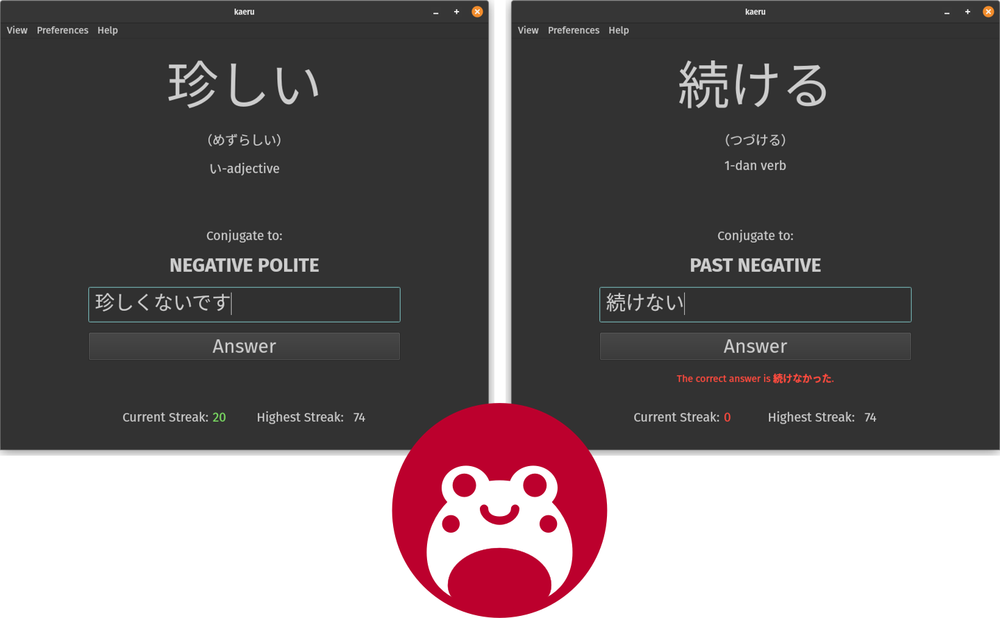

[:uk: English](/) | :brazil: **Português**

# kaeru

Treinador de conjugação de verbos e adjetivos em japonês para estudantes de todos os
níveis.



- Treino ágil e focado
- Aleatoriamente seleciona uma palavra (verbo/adjetivo) e uma flexão-alvo
- Pede a conjugação correta da palavra apresentada
- Gerador de vocabulário escolhe as palavras mais comuns pela mídia japonesa
- Vocabulário em JSON simples e customizável
- Exibe leitura em kana, tipo de palavra
- Contador de pontuação sequencial
- GUI (Qt) e CLI disponíveis
- Internacionalização: disponível em Português, [Inglês](/)
- Multiplataforma


O nome vem de 変える (mudar, transformar) e カエル (sapo 🐸), ambos lidos como *kaeru*
(ka-**ê**-**rú**).


## Setup

1. Clone o repositório:
    ```sh
    git clone https://github.com/purewave0/kaeru.git
    cd kaeru
    ```

2. Prepare o ambiente virtual:
    ```sh
    python3 -m venv env
    source env/bin/activate
    ```

3. Instale as dependências necessárias:
    ```sh
    pip install -r requirements.txt
    ```

4. Compile os arquivos do projeto:
    ```sh
    pyside6-project build
    ```


## Utilização

Primeiro, gere o arquivo de vocabulário, que contém todas as palavras usadas pelo
programa:
```sh
python3 gen-vocab.py
```

Agora, execute o kaeru:
```sh
pyside6-project run
```

Caso prefira treinar pelo terminal, execute:
```sh
python3 kaeru-cli.py
```


## Opções

### `gen-vocab.py`

| Opção | Descrição |
|--------|-------------|
| `-n`, `--limit-per-type` | o número máximo de verbos e de adjetivos para buscar (padrão: 100 de cada)
| `-o`, `--output` | onde salvar o JSON final (padrão: `vocab.json`) |

### `kaeru.py`

> [!NOTE]
> Para passar opções, rode o `kaeru.py` diretamente em vez de usar o `pyside6-project`.

| Opção | Descrição |
|--------|-------------|
| `-i`, `--vocab-file` | caminho para o arquivo de vocabulário (padrão: `vocab.json`) |

Na interface gráfica:

- **Exibir > Leitura em kana**: se deve mostrar a leitura em kana para palavras com
kanji
- **Exibir > Tipo de palavra**: se deve mostrar o tipo de palavra ("verbo 5-dan",
"adjetivo い", etc.)
- **Preferências > Revelar resposta ao errar**: se deve revelar a resposta correta ao
errar


### `kaeru-cli.py`

| Opção | Descrição |
|--------|-------------|
| `-i`, `--vocab-file` | caminho para o arquivo de vocabulário (padrão: `vocab.json`) |
| `-K`, `--hide-kana` | não mostrar a leitura em kana para palavras com kanji |
| `-T`, `--hide-word-type` | não mostrar o tipo de palavra |
| `-r`, `--reveal-answer` | revelar a resposta correta ao errar |


## Testes

Primeiro, instale as dependências:
```sh
pip3 install -r requirements-dev.txt
```

Execute todos os testes com:
```sh
python3 -m pytest
```


## Créditos

- [yomitan-dictionaries do Kuuuube](https://github.com/Kuuuube/yomitan-dictionaries)
pelo JSON da lista de frequência de palavras do JPDB.io
- [JMdict Simplified](https://github.com/scriptin/jmdict-simplified/) pelo JMdict em
formato JSON
